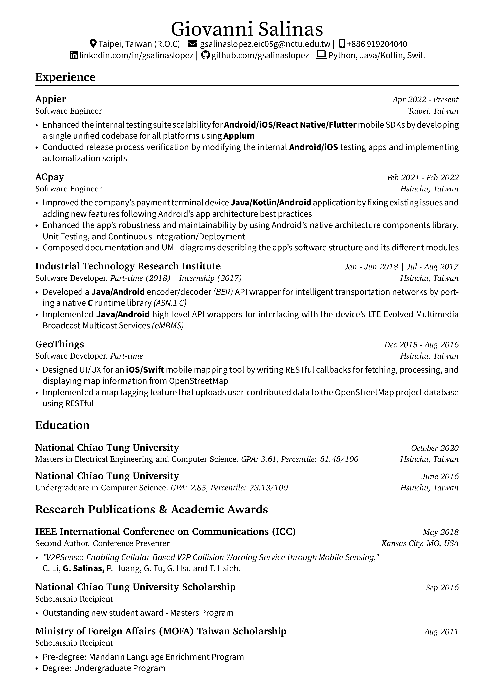
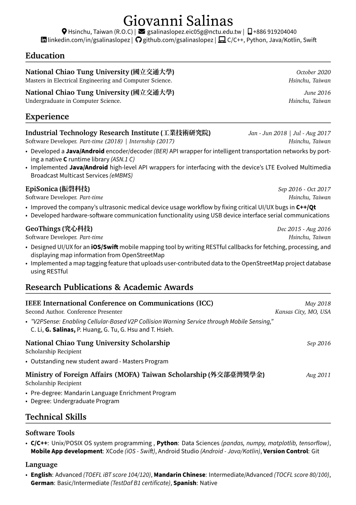

Personal CV using LaTeX. English and Hybrid (Chinglish) versions.

Feel free to use the template as you wish :)

### Preview

| | |
|:---: | :---: |
| |  |

### Fonts

[Source Serif Pro](https://fonts.google.com/specimen/Source+Serif+Pro#license) for the title and headings.

[Source Sans Pro](https://fonts.google.com/specimen/Source+Sans+Pro#license) for content description.

[Source Han Serif](https://source.typekit.com/source-han-serif/?src=GoogleFonts) for the Chinese characters.
