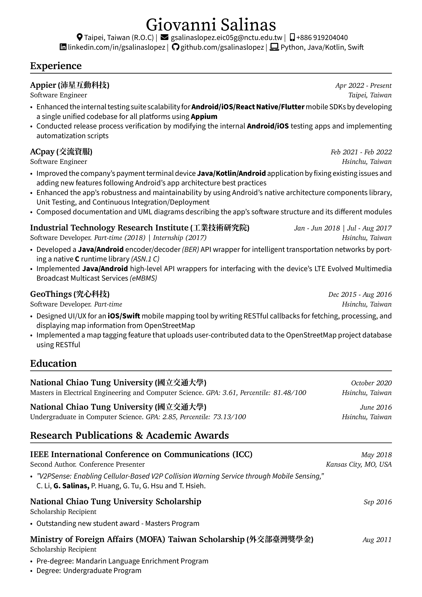

Personal CV using LaTeX. English and Hybrid (Chinglish) versions.

Feel free to use the template as you wish :)

### Build
```
$ docker run -it -v $(pwd):/workdir --rm registry.gitlab.com/islandoftex/images/texlive:TL2023-2023-08-13-full bash
root@container-id# apt update && apt install -y wget
root@container-id# cd /
root@container-id# mkdir fonts
root@container-id# cd /fonts
root@container-id# wget https://github.com/adobe-fonts/source-han-serif/releases/download/2.003R/01_SourceHanSerif.ttc.zip
root@container-id# unzip 01_SourceHanSerif.ttc.zip
root@container-id# cp SourceHanSerif.ttc /usr/local/share/fonts/
root@container-id# fc-cache
root@container-id# cd /workdir/
root@container-id# xelatex ...
```

### Preview

| English | Hybrid (Chinglish) |
|:---: | :---: |
|[](https://raw.githubusercontent.com/gsalinaslopez/cv/main/Giovanni_Salinas_resume_en.pdf) | [](https://raw.githubusercontent.com/gsalinaslopez/cv/main/Giovanni_Salinas_resume_cn_en.pdf) |

| 2 Page version (1) | 2 Page version (2) |
|:---: | :---: |
|[](https://raw.githubusercontent.com/gsalinaslopez/cv/main/Giovanni_Salinas_resume_2pp_en.pdf) | [](https://raw.githubusercontent.com/gsalinaslopez/cv/main/Giovanni_Salinas_resume_2pp_en.pdf) |

| Cover Letter |
|:---: |
|[](https://raw.githubusercontent.com/gsalinaslopez/cv/main/Giovanni_Salinas_cover_letter.pdf) |
### Fonts

[Source Serif Pro](https://fonts.google.com/specimen/Source+Serif+Pro#license) for the title and headings.

[Source Sans Pro](https://fonts.google.com/specimen/Source+Sans+Pro#license) for content description.

[Source Han Serif](https://github.com/adobe-fonts/source-han-serif) for the Chinese characters.

### Credit

Template for cover letter taken from: https://tex.stackexchange.com/questions/583798/newlfm-expect-new-fancyhdr-sty-but-its-the-newest, thanks to [Werner](https://tex.stackexchange.com/users/5764/werner)
